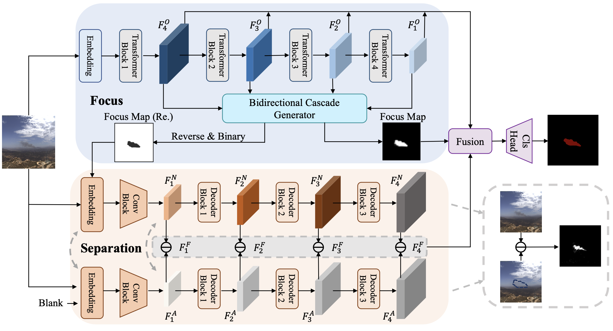

# FoSp: Focus and Separation Network for Early Smoke Segmentation
This repository is the implementation of our AAAI-24 paper: [FoSp: Focus and Separation Network for Early Smoke Segmentation.](https://ojs.aaai.org/index.php/AAAI/article/view/28484)

## Abstract
Early smoke segmentation (ESS) enables the accurate identification of smoke sources, facilitating the prompt extinguishing of fires and preventing large-scale gas leaks. But ESS poses greater challenges than conventional object and regular smoke segmentation due to its small scale and transparent appearance, which can result in high miss detection rate and low precision. To address these issues, a Focus and Separation Network (FoSp) is proposed. We first introduce a Focus module employing bidirectional cascade which guides low-resolution and high-resolution features towards mid-resolution to locate and determine the scope of smoke, reducing the miss detection rate. Next, we propose a Separation module that separates smoke images into a pure smoke foreground and a smoke-free background, enhancing the contrast between smoke and background fundamentally, improving segmentation precision. Finally, a Domain Fusion module is developed to integrate the distinctive features of the two modules which can balance recall and precision to achieve high F_beta. Futhermore, to promote the development of ESS, we introduce a high-quality real-world dataset called SmokeSeg, which contains more small and transparent smoke than the existing datasets. Experimental results show that our model achieves the best performance on three available smoke segmentation datasets.

## FoSp Overview
Concentrating on the formulation of smoke images, we first introduce a Focus module employing bidirectional cascade which guides low-resolution and high-resolution features towards mid-resolution to locate and determine the scope of smoke, reducing the miss detection rate. Next, we propose a Separation module that separates smoke images into a pure smoke foreground and a smoke-free background, enhancing the contrast between smoke and background fundamentally, improving segmentation precision. Finally, a Domain Fusion module is developed to integrate the distinctive features of the two modules which can balance recall and precision to achieve high F_beta. The proposed model pipeline is: 



## Visualization
It can be observed that our FoSp can obtain finer foreground for both small and transparent smoke.


## Main code infrastructure
- [fosp_config.py](config/fosp_config.py)
    - This script establishes the general configuration of FoSp, encompassing dataset, training, and testing settings, among others.
- [FOSP_main.py](mmseg/models/decode_heads/FOSP_main.py)
    - This script includes the implementation of Bidirectional Cascade Generator (BCG), Separation module, and Domain Fusion module in our FoSp method.

## Prerequisites
- Linux
- Python 3.8
- PyTorch 1.8.0
- Cuda 11.1
- GCC 7.3.0+
 

## Installation
**Step 1.** create new environment.
```shell
conda create -n FoSp python=3.8 -y
conda activate FoSp
```

**Step 2.** Install [MMCV](https://github.com/open-mmlab/mmcv) using [MIM](https://github.com/open-mmlab/mim).

```shell
pip install -U openmim
mim install mmcv-full
```

**Step 3.** Install FoSp.

```shell
cd FoSp
pip install -v -e .
```

**Step 4.** Install other packages.
```shell
pip install -r requirements.txt
```

## Dataset preparation
The Dataset structure employs the file directory format of the PASCAL VOC. We have utilized a limited number of images as training examples. If you need to use your own dataset, please switch it to this format.

```shell
FoSp
├── mmseg
├── tools
├── config
├── data
│   ├── {Your Dataset}
│   │   ├── JPEGImages
│   │   ├── SegmentationClass
│   │   ├── ImageSets
│   │   │   ├── Segmentation
```

The SmokeSeg Dataset will be provided on [request](https://forms.gle/7WAjTo71XpQYPFSB9).

## Training
```shell
python tools/train.py config/fosp_config.py
```
## Evaluation
```shell
python tools/test.py --config ${path/to/config} --checkpoint ${path/to/checkpoint}
```

## Citation

If you find our work useful in your research, please consider citing:

```bibtex
@inproceedings{yao2024fosp,
  title={FoSp: Focus and separation network for early smoke segmentation},
  author={Yao, Lujian and Zhao, Haitao and Peng, Jingchao and Wang, Zhongze and Zhao, Kaijie},
  booktitle={Proceedings of the AAAI Conference on Artificial Intelligence},
  volume={38},
  number={7},
  pages={6621--6629},
  year={2024}
}
```

## References
This code uses the [MMSegmentation](https://github.com/open-mmlab/mmsegmentation) framework. Please see [train](https://github.com/open-mmlab/mmsegmentation/blob/master/docs/en/train.md) and [inference](https://github.com/open-mmlab/mmsegmentation/blob/master/docs/en/inference.md) for the detailed usage of MMSegmentation.
